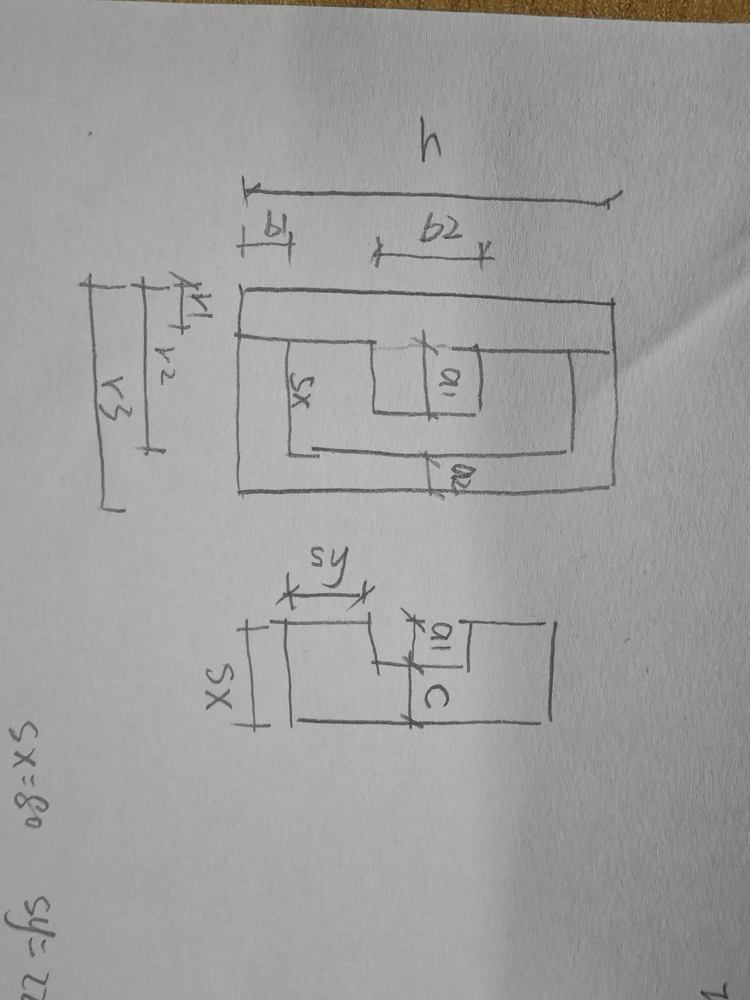
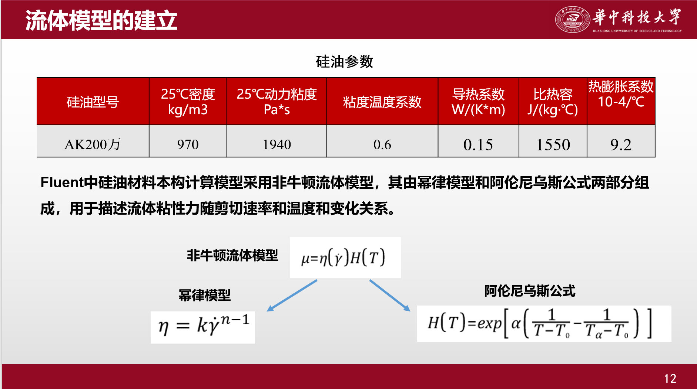
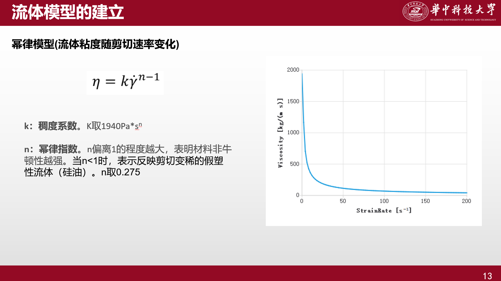
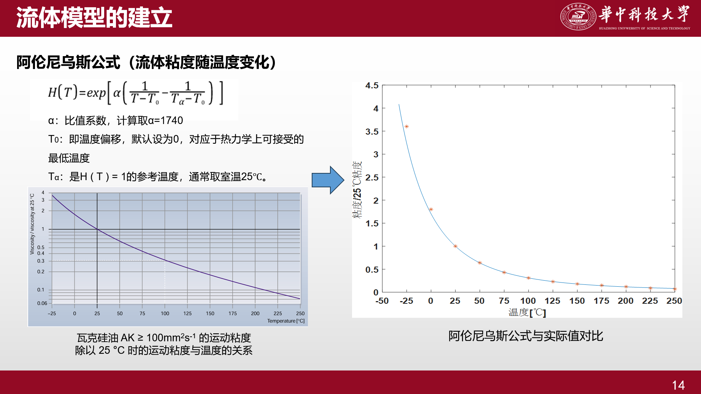

### 阻尼器参数化建模

参数如图：

### 鑫拓力项目阻尼器参数如下(单位: mm)：

* r1=60, r2=140, r3=190
* sx=80, sy=220
* b1=100, b2=120,
* a1=78 , a2=50
* c=2

### 鑫拓力项目项目加载参数：
* 位移幅值: 50mm
* 加载周期: 0.314s

### 数据集参数范围设计
#### A. 核心高敏感参数 (决定阻尼力和非线性特征)
| 参数  | 物理意义      | 鑫拓力基础值 | 推荐采样范围 | 采样点数 |
| :---: | :---:        | ---:        | :---         | :---: |
| c     | 阻尼通道缝隙  | 2mm         | 1mm-3mm, step=0.2mm | 10 |
| sx    | 腔室宽度      | 80mm        | 40-120mm, step=10mm | 8 |
| sy    | 腔室高度      | 220mm       | 120-320mm, step=20mm | 10 |

#### B. 宏观几何结构 (决定外壳刚度与总热耗散)
| 参数  | 物理意义      | 鑫拓力基础值 | 推荐采样范围 | 采样点数 |
| :---: | :---:        | ---:        | :---         |  :---: |
| r1    | 活塞半径      | 60mm        | 50mm-70mm, step=5mm | 4 |
| a2    | 套筒外壁厚    | 50mm        | 40mm-80mm, step=10mm | 4 |
| b1    | 套筒端壁厚    | 100mm        | 80mm-120mm, step=10mm | 4 |
| b2    | 活塞高        | 120mm        | 80mm-160mm, step=10mm | 8 |

其余未涉及几何参数均可由上述参数计算确定

#### 加载参数
| 参数  | 物理意义      | 鑫拓力基础值 | 推荐采样范围             | 采样点数 |
| :---: | :---:        | ---:        | :---                    |  :---: |
| A     | 加载幅值      | 50mm        | 10mm-90mm, step=5mm     | 4 |
| Ts     | 周期        | 0.314s       | 0.1-0.5s, step=0.1s    | 4 |

#### 材料参数
##### 固体：钢材使用comsol材料库钢材：Steel AISI 4340
| 物理量  | comsol变量名                                     | 数值 | 单位          |
| :---:     | :---:                                         | :---:    |---:                    |
|热膨胀系数	|   alpha_iso ; alphaii = alpha_iso, alphaij = 0 |	12.3e-6[1/K]	|1/K	|
|恒压热容	|   Cp	                                        |475[J/(kg*K)]	|J/(kg·K)	|
|密度	    |   rho	                                        |       7850[kg/m^3]              |	kg/m³|	
|导热系数|  	k_iso ; kii = k_iso, kij = 0	            |44.5[W/(m*K)]  |	W/(m·K)	
|杨氏模量	|   E                                           |	205[GPa]    |	Pa	
|泊松比	|   nu	                                        |0.28       	| 1	|

##### 鑫拓力硅油参数

| 参数  | 物理意义      | 鑫拓力基础值 | 推荐采样范围             | 采样点数 |
| :---: | :---:        | ---:        | :---                    |  :---: |
| mu    | 25℃动力粘度  | 1940 Pa*s  |   1000 ~ 3000 Pa·s (连续空间)

注意：幂律指数 $n = 1 - 0.725 = 0.275$。在流体力学中，这是一个极其猛烈的剪切变稀流体。在剪切速率趋于0的时候，粘度会趋于非常大，所以这里使用Carreau 模型替代纯幂律
mu_0 * (1 + (spf.sr / sr_ref)^2)^(-0.3625)。
也可以限制动力粘度的上限

参数解释：
* mu_0：你的零剪切粘度（流体静止时的最大粘度，例如 3000 [Pa*s]）。
* sr_ref：临界剪切速率（例如 0.1 [1/s]，表示剪切率超过这个值后，流体开始剧烈变稀）。
* -0.3625：这是怎么来的？Carreau 模型的指数是 $\frac{n-1}{2}$。既然你需要 $n-1 = -0.725$，那么一半就是 -0.3625。

#### 实际不按每个采样点进行组合，这样样本太大了。实际按拉丁超立方抽样 (LHS)，在所有参数范围内，随机采样如1000个样本。
LHS（按行组合）： 我们将参数分为了几何、加载、材料属性分别进行LHS，保存在3个Json里。注意，这里总的参数集不是类似张量积。例如抽取1000个样本，在几何、加载、材料属性分别抽取1000个，然后按对应位置拼接，类似笛卡尔积。

### 关于求解器设置和初始计算发散：
* 1. 修改位移载荷函数（零初速起步）—— 最根本的解决办法不要使用普通的正弦波 $\sin(\omega t)$，因为它在 $t=0$ 时导数（速度）不为零。请将你的指定位移 (Prescribed Displacement) 公式修改为余弦起步：$$u = A \cdot \left(1 - \cos\left(\frac{2\pi}{T_s} t\right)\right)
    * 为什么这有用？
    * 当 $t=0$ 时，$u = A(1 - 1) = 0$（位移是连续的）。它的速度 $v = A \frac{2\pi}{T_s} \sin(\frac{2\pi}{T_s} t)$。当 $t=0$ 时，$v = 0$。这样流体和活塞在初始时刻都是静止的，完全消除了瞬间的无穷大冲击力。

* 2. 关闭“一致初始化” (Consistent Initialization)如果载荷修改后仍然报同样的错，说明求解器在尝试自己“修正”你的第 0 秒状态时搞砸了。
    * 进入 研究 1 (Study 1) > 步骤 1: 瞬态 (Step 1: Time Dependent)。
    * 在设置窗口中找到 一致初始化 (Consistent Initialization) 选项。
    * 将它从“向后欧拉 (Backward Euler)” 或 “自动” 改为 关闭 (Off)。
    * （既然你已经保证了初速为 0，就不需要 COMSOL 去瞎猜了）。

* 3. 将“分离式求解器”改为“全耦合求解器” (Highly Recommended)从你的截图中看到，顶部写着“分离式求解器 (Segregated Solver)”。分离式求解器是先算一遍速度，再去算温度，来回倒腾。对于你这种具有极强剪切变稀特性的高粘度流体，速度、压力和粘度是死死绑在一起的，分离式很容易发散。
    * 在模型树中展开 研究 1 > 求解器配置 > 求解器 1 > 瞬态求解器 1。
    * 右键点击 瞬态求解器 1，选择 全耦合 (Fully Coupled)。
    * 出现全耦合节点后，右键原来的 分离式 1 节点，选择 禁用 (Disable) 或直接删除。
    * 在“全耦合”节点的设置中，将 非线性方法 (Nonlinear method) 设为 恒定（牛顿） (Constant (Newton)) 或 自动高度非线性 (Automatic highly nonlinear)。