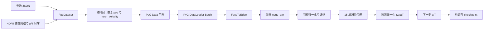

# 黏滞阻尼器 MeshGraphNet 技术文档

## 1. 文档目的

本文档说明从 COMSOL 计算结果到 MeshGraphNet 模型存档的完整流程，包括：

1. 参数 JSON 与 HDF5 数据如何存储。
2. 如何从静态参考网格实时恢复任意时刻的动网格位置和网格速度。
3. 单个时间步如何封装为 PyTorch Geometric `Data` 对象。
4. 多个图如何组成 Batch，以及节点、面和边索引如何变化。
5. MeshGraphNet 的输入特征、消息传递层、参数量和预测目标。
6. 训练、验证、TensorBoard、checkpoint 与断点恢复流程。

当前实现预测相邻时间步的压力 `p` 和温度 `T`，属于单步监督学习。模型输出的是归一化后的场增量 `Δp, ΔT`。

## 2. 代码结构

```text
meshGraphNet_self/
├── dataset.py                  # HDF5、JSON、动态图和单步样本读取
├── mesh_motion.py              # 独立的三区域动网格解析还原
├── graph.py                    # face -> edge_index/edge_attr
├── train_worker.py             # 由 training_workspace/train.py 调用的内部训练进程
├── training.py                 # 两模型共享的训练、验证和存档流程
├── model/
│   ├── blocks.py               # EdgeBlock、NodeBlock
│   ├── network.py              # Encoder-Processor-Decoder
│   └── simulator.py            # 特征编码、归一化和 Δp/ΔT 预测
├── utils/
│   └── normalization.py        # 在线统计均值和标准差
├── requirements.txt
└── README.md
```

## 3. 总体数据流



## 4. 参数 JSON

参数文件为 `计算有限元数据/4_Combined_Master_Dataset.json`。顶层结构如下：

```json
{
  "dataset_metadata": {},
  "parameters_list": [
    {
      "case_id": "Case_0050",
      "geometry": {},
      "loading": {},
      "material": {}
    }
  ]
}
```

每个 HDF5 文件名与 `case_id` 一一对应，例如 `Case_0050.h5` 对应 JSON 中的 `Case_0050`。

### 4.1 几何参数

| 参数 | 含义 | JSON 单位 | 输入模型单位 |
|---|---|---:|---:|
| `c` | 阻尼通道间隙 | mm | m |
| `sx` | 液体径向宽度，且 `r2=r1+sx` | mm | m |
| `sy` | 上、下腔室网格过渡高度 | mm | m |
| `r1` | 液体区域内侧半径 | mm | m |
| `a2` | 套筒壁厚，且 `r3=r2+a2` | mm | m |
| `b1` | 上、下端壁厚 | mm | m |
| `b2` | 活塞轴向高度，即中间网格区域高度 | mm | m |

派生尺寸：

```text
r2    = r1 + sx
r3    = r2 + a2
h_all = 2*b1 + 2*sy + b2
```

HDF5 中导出的液体网格径向范围为 `R∈[r1,r2]`。`r3-r2=a2` 是固体套筒壁厚，不属于当前液体网格。

### 4.2 加载和材料参数

| 参数 | 含义 | JSON 单位 | 输入模型单位 |
|---|---|---:|---:|
| `A` | 位移函数参数 | mm | m |
| `Ts` | 加载周期 | s | s |
| `mu` | 动力黏度 | Pa·s | Pa·s |

这 10 个参数按固定顺序组成图级静态特征：

```text
[c, sx, sy, r1, a2, b1, b2, A, Ts, mu]
```

几何量与 `A` 在 `dataset.py` 中乘 `1e-3` 转换为 SI 单位。

## 5. HDF5 数据存储

### 5.1 文件结构

```text
Case_XXXX.h5
├── mesh
│   ├── coordinates       float64 [N, 3]
│   └── connectivity      int64   [4*C]
├── time_steps            float64 [S]
└── fields
    ├── p                 float32 [S, N]
    └── T                 float32 [S, N]
```

含义：

- `N`：节点数。
- `C`：三角形单元数。
- `S`：时间步数。
- `coordinates`：静态参考网格坐标，只存一次。
- `connectivity`：VTK 扁平单元格式，每个三角形表示为 `[3,n0,n1,n2]`。
- `fields/p[t,:]`：时间索引 `t` 的全部节点压力。
- `fields/T[t,:]`：时间索引 `t` 的全部节点温度。

数据集使用 gzip 压缩。HDF5 不保存每一时刻的节点坐标，节点坐标由解析运动规律实时恢复。

### 5.2 当前数据集实际统计

| 项目 | 数值 |
|---|---:|
| HDF5 case 数 | 246 |
| 每个 case 节点数 `N` | 725 |
| 每个 case 三角形数 `C` | 1280 |
| `connectivity` 长度 | 5120 |
| 每个 case 时间步数 `S` | 151 |
| 每个 case 相邻时间样本数 | 150 |
| 总图样本数 | 36,900 |
| 时间起点 | 0 s |
| 时间终点范围 | 0.324–1.5 s |
| 相邻时间间隔范围 | 0.00216–0.01 s |

不同 case 的 `Ts` 不同，因此真实 `dt` 也不同。训练样本使用 HDF5 中的真实 `time_steps`，不能假定所有 case 具有相同 `dt`。

### 5.3 Case_0050 示例

```text
coordinates:  (725, 3) float64
connectivity: (5120,)  int64
time_steps:   (151,)   float64, 0.0 -> 0.54 s
p:            (151,725) float32
T:            (151,725) float32
R:            0.05266 -> 0.10696 m
Z:            0.11780 -> 0.81599 m
```

## 6. 实时动网格还原

### 6.1 三个区域

参考坐标使用 `(R,Z)`，运动只发生在 `Z` 方向。液体网格范围为：

```text
R: r1 <= R <= r2
Z: b1 <= Z <= h_all-b1
```

按参考坐标 `Z` 划分三个区域：

| 区域编号 | 区域名 | 参考坐标范围 |
|---:|---|---|
| 0 | `LOWER` | `b1 <= Z < b1+sy` |
| 1 | `MIDDLE` | `b1+sy <= Z <= b1+sy+b2` |
| 2 | `UPPER` | `b1+sy+b2 < Z <= h_all-b1` |

区域交界节点无位移不连续问题，因为两侧公式在交界处都等于中间区域位移。

### 6.2 位移

COMSOL 当前位移函数为：

```text
m_middle(t) = A * (1-cos(2*pi*t/Ts))
```

三个区域分别使用：

```text
m_down   = (Z-b1)/sy * m_middle
m_middle = m_middle
m_up     = (h_all-b1-Z)/sy * m_middle
```

定义节点运动权重 `w_i` 后，可以统一写成：

```text
Z_i(t) = Z_i(0) + w_i * m_middle(t)
R_i(t) = R_i(0)
```

其中下段权重从 0 线性增加到 1，中段恒为 1，上段从 1 线性减小到 0。

注意：该公式在 `t=Ts/2` 时达到 `2A`，因此这里的 `A` 不是“最大位移值”，而是 COMSOL 公式中的参数。

### 6.3 网格速度

中间区域速度是位移函数的解析导数：

```text
v_middle(t) = A * (2*pi/Ts) * sin(2*pi*t/Ts)
```

节点网格速度为：

```text
v_mesh_i = [0, w_i*v_middle(t)]
```

这里使用名称 `mesh_velocity`，用于区分 ALE 网格速度和未来可能加入的硅油物理速度场。

### 6.4 任意时间接口

```python
dataset = FpcDataset(
    data_root="计算有限元数据/comsol_hdf5",
    split="all",
)

mesh = dataset.get_mesh_at_time("Case_0050", time=0.09)
```

该接口可以接受任意浮点时间并恢复网格，但只有 HDF5 离散时间点具有对应的 `p/T` 标签。

## 7. 单图 Data 对象

`FpcDataset.get(index)` 返回一个 PyG `Data`：

| 属性 | 形状 | 含义 |
|---|---|---|
| `x` | `[N,3]` | `[node_type,p_t,T_t]` |
| `y` | `[N,2]` | `[p_(t+1),T_(t+1)]` |
| `pos` | `[N,2]` | 当前时刻 `(R,Z)` |
| `face` | `[3,C]` | 三角形节点索引 |
| `mesh_region` | `[N]` | 下、中、上区域编号 |
| `mesh_motion_weight` | `[N]` | 节点相对活塞位移的权重 |
| `node_displacement` | `[N,1]` | 当前节点 Z 位移 |
| `mesh_velocity` | `[N,2]` | 当前 ALE 网格速度 |
| `piston_displacement` | `[1]` | `m_middle(t)` |
| `piston_velocity` | `[1]` | `dm_middle/dt` |
| `time` | `[1]` | 当前物理时间 |
| `case_features` | `[1,10]` | 几何、加载和材料参数 |
| `case_id` | 字符串 | case 标识 |

当前 `node_type` 全部为 `NORMAL`，模型暂不使用它。保留该列是为了以后加入壁面、入口、出口等节点类型。

## 8. 数据索引和数据集切分

### 8.1 相邻时间样本

每个 case 有 151 个时间步，构成 150 个监督样本：

```text
(t0 -> t1), (t1 -> t2), ..., (t149 -> t150)
```

`index_map` 保存 `(HDF5 文件路径, 当前时间索引)`，因此 `dataset[index]` 可以定位到一个 case 的一个相邻时间对。

### 8.2 按 case 切分

HDF5 文件先按文件名排序，再按 8:1:1 切分：

| split | case 数 | 图样本数 |
|---|---:|---:|
| train | 196 | 29,400 |
| valid | 25 | 3,750 |
| test | 25 | 3,750 |

切分发生在 case 层级，同一条时间轨迹不会同时进入训练集和验证集，避免时间泄漏。

### 8.3 网格缓存

每个 Dataset worker 第一次访问某个 case 时读取：

- 静态参考坐标。
- 三角形拓扑。
- JSON 参数。
- 节点区域和运动权重。

这些静态内容保存在 `mesh_cache`，后续时间步只需读取 `p/T` 并计算当前解析位移。

## 9. PyG Batch

`torch_geometric.loader.DataLoader` 将多个不同图拼为一个不连通大图。

假设 Batch 中有 `B` 个图，每图 725 个节点：

```text
总节点数 = B * 725
```

PyG 在拼接时会自动给后续图的 `face` 和 `edge_index` 加节点偏移，因此不同图之间不会产生错误连接。`batch` 向量记录每个节点属于哪个图：

```text
graph.batch.shape = [总节点数]
graph.batch[i] = 第 i 个节点所属图编号
```

图级数据的 Batch 形状：

```text
case_features       [B,10]
time                [B]
piston_displacement [B]
piston_velocity     [B]
```

模型通过 `graph.batch` 将图级上下文广播到各自图的全部节点。

真实双图 Batch 验证结果：

```text
节点:       1450
三角形:     2560
有向边:     8016
edge_attr: (8016,3)
x:         (1450,3)
y:         (1450,2)
```

默认 `batch_size=4` 时，对当前固定规模数据通常为 2900 个节点、5120 个三角形和约 16032 条有向边。

## 10. 从三角形到图

`graph.py` 在每个 Batch 上执行：

```text
FaceToEdge -> Cartesian -> Distance
```

### 10.1 FaceToEdge

每个三角形 `(i,j,k)` 产生节点邻接关系。PyG 合并重复边并构造双向消息传递边。

当前单图统计：

```text
725 nodes
1280 triangular faces
4008 directed edges
```

### 10.2 边特征

由于 `pos` 是当前时刻恢复后的坐标，边特征会随网格运动实时更新：

```text
edge_attr_ij = [R_i-R_j, Z_i-Z_j, ||pos_i-pos_j||]
```

边输入维度为 3。拓扑不变，但相对位置和边长可能随时间变化。

## 11. 节点输入特征

默认节点编码维度为 22：

| 特征组 | 维度 | 是否归一化 |
|---|---:|---|
| 当前场 `[p_t,T_t]` | 2 | 是 |
| 当前坐标 `[R_t,Z_t]` | 2 | 是 |
| 网格速度 `[v_R,v_Z]` | 2 | 是 |
| 网格区域 one-hot | 3 | 否 |
| 图级上下文 | 13 | 是 |
| 合计 | 22 | - |

图级上下文 13 维包括：

```text
10 个 case_features
+ 当前 time
+ piston_displacement
+ piston_velocity
```

加入绝对坐标的原因是模型为轴对称 `(R,Z)` 问题，径向位置 `R` 参与物理规律，不能只依赖平移不变的相对边向量。

## 12. 归一化

模型维护六组冻结 Normalizer：

| Normalizer | 维度 |
|---|---:|
| 当前 `p/T` | 2 |
| 当前坐标 | 2 |
| 网格速度 | 2 |
| 图级上下文 | 13 |
| 边特征 | 3 |
| 目标 `Δp/ΔT` | 2 |

开始优化网络前，程序只遍历一次训练集，并使用 `float64` batch-Welford
算法流式合并每个 batch 的样本数、均值和离均差平方和 `M2`：

```text
n, mean, M2
delta    = batch_mean - mean
new_mean = mean + delta * batch_n/(n+batch_n)
new_M2   = M2 + batch_M2 + delta^2*n*batch_n/(n+batch_n)
```

并计算：

```text
variance = M2/n
std      = sqrt(variance)
x_norm = (x-mean)/std
```

`n=100` 时，节点场统计覆盖 `100×150×725=10,875,000` 个节点-时间样本；
目标统计覆盖对应的 150 个相邻时间增量。统计阶段按 batch 流式读取，不会把这些样本一次性装入内存。
统计完成后立即冻结，网络的第一个优化步骤以及后续训练、验证、测试和 rollout
始终使用同一组数值。验证集和测试集不参与统计。统计量既单独写入
`normalization_stats.pt`，也作为模型 buffer 随 `state_dict` 写入 checkpoint。

Welford 算法避免 `E[x^2]-E[x]^2` 的大数消减误差。真正恒定的通道（例如恒为零的
`mesh_velocity_x`）使用有效标准差 1，归一化后仍为零；`p/T` 或 `Δp/ΔT` 若被统计为
常量则训练立即报错。

## 13. MeshGraphNet 网络结构

### 13.1 默认配置

| 参数 | 默认值 |
|---|---:|
| 节点输入维度 | 22 |
| 边输入维度 | 3 |
| 隐藏维度 | 128 |
| 消息传递块数 | 15 |
| 输出维度 | 2 |
| 总可训练参数量 | 2,879,234 |

参数分布：

| 模块 | 参数量 |
|---|---:|
| Encoder | 103,040 |
| 15 个 Processor block | 2,726,400 |
| Decoder | 49,794 |
| 总计 | 2,879,234 |

### 13.2 MLP 结构

编码器和 Processor 内部每个 MLP 为：

```text
Linear(in,128)
ReLU
Linear(128,128)
ReLU
Linear(128,128)
ReLU
Linear(128,out)
LayerNorm(out)
```

Decoder 使用同样的 4 个 Linear 和 3 个 ReLU，但最后没有 LayerNorm，输出 2 维 `Δp/ΔT`。

### 13.3 Encoder

```text
node_encoder: 22 -> 128
edge_encoder:  3 -> 128
```

编码后所有节点和边都进入 128 维隐空间。

### 13.4 Processor

默认顺序执行 15 个 GraphNetworkBlock。每个块包括 EdgeBlock 和 NodeBlock。

EdgeBlock：

```text
edge_input_ij = [node_i, node_j, edge_ij]
维度 = 128 + 128 + 128 = 384
updated_edge_ij = EdgeMLP(edge_input_ij)
edge_ij <- edge_ij + updated_edge_ij
```

NodeBlock：

```text
received_j = sum(updated_edge_ij for all i -> j)
node_input_j = [node_j, received_j]
维度 = 128 + 128 = 256
updated_node_j = NodeMLP(node_input_j)
node_j <- node_j + updated_node_j
```

边聚合使用求和。节点和边均采用残差连接，便于 15 层消息传递稳定训练。

### 13.5 Decoder 和预测目标

网络预测归一化场增量：

```text
target_delta = [p_(t+1)-p_t, T_(t+1)-T_t]
```

推理时：

```text
predicted_delta = output_normalizer.inverse(network_output)
predicted_next  = [p_t,T_t] + predicted_delta
```

预测增量通常比直接预测绝对压力和温度更容易学习，并与原始 MeshGraphNet 的状态更新思想一致。

## 14. 训练流程

### 14.1 环境

后续统一使用 conda `pinn` 环境：

```powershell
conda activate pinn
python -c "import torch, h5py, torch_geometric; print(torch.__version__)"
```

已验证的环境：

```text
Python 3.12.12
torch: available
h5py: available
torch_geometric: available
tensorboard: available
tqdm: available
```

### 14.2 启动训练

在仓库根目录执行：

```powershell
conda activate pinn
python training_workspace\train.py
```

训练参数统一在 `training_workspace/train.py` 最下方定义。只训练 MeshGraphNet 时设置：

```python
MODELS = ["meshgraphnet"]
TRAIN_SIZES = [100]
SEEDS = [42]
EPOCHS = 100
BATCH_SIZE = 4
DEVICE = "auto"
DRY_RUN = False
```

`DEVICE = "auto"` 会优先使用 CUDA，CUDA 不可用时使用 CPU。`train_worker.py`
是调度器启动的内部进程，不作为人工入口。

### 14.3 默认训练参数

| 参数 | 默认值 |
|---|---:|
| epochs | 100 |
| batch size | 4 |
| learning rate | `1e-4` |
| weight decay | 0 |
| hidden size | 128 |
| message passing steps | 15 |
| gradient clip | 1.0 |
| periodic save | 每 10 epoch |
| random seed | 42 |
| optimizer | Adam |
| scheduler | ReduceLROnPlateau |

### 14.4 单个训练 Batch

每个 Batch 执行：

1. 根据当前 `pos` 从 `face` 生成 `edge_index/edge_attr`。
2. 将 Batch 移到 CPU 或 GPU。
3. 使用训练前已经冻结的 Normalizer 归一化特征和目标。
4. 编码节点、边和图级上下文。
5. 执行 15 层消息传递。
6. 计算预测和目标的归一化 MSE。
7. 反向传播。
8. 梯度范数裁剪。
9. Adam 更新参数。

### 14.5 验证指标

每个 epoch 输出：

```text
train_mse       归一化训练 MSE
valid_mse       归一化验证 MSE
p_rmse          压力原始单位 RMSE，Pa
T_rmse          温度原始单位 RMSE，K
lr              当前学习率
```

最佳模型按 `valid_mse` 选择。使用归一化 MSE 可以避免压力数值尺度远大于温度而完全支配模型选择。

## 15. 模型存档

默认目录为 `meshGraphNet_self/checkpoints`。

| 文件 | 含义 |
|---|---|
| `last.pt` | 每个 epoch 更新，保存最新完整训练状态 |
| `best.pt` | 验证集归一化 MSE 最低的状态 |
| `epoch_XXXX.pt` | 周期快照，默认每 10 epoch |
| `training_config.json` | 命令行和网络配置 |

checkpoint 内容：

```text
epoch
global_step
model_state_dict
optimizer_state_dict
scheduler_state_dict
best_valid_loss
model_config
field_names
case_feature_names
```

`model_state_dict` 同时包含网络权重和全部 Normalizer 统计。

保存采用临时文件写入后替换正式文件，避免训练中断产生半写入 checkpoint。

### 15.1 断点恢复

保持 `training_workspace/train.py` 中的模型、规模、随机种子和 `OUTPUT_ROOT` 不变，再次执行
`python training_workspace\train.py`。调度器会读取任务目录中的 `last.pt`，从最近的完整 epoch 自动恢复。

恢复内容包括模型、优化器、学习率调度器、epoch、global step 和最佳验证损失。

## 16. TensorBoard

日志写入 `OUTPUT_ROOT/<模型>/<规模>/<种子>/tensorboard`。例如：

```powershell
conda activate pinn
tensorboard --logdir training_workspace/runs/meshgraphnet/n0100/seed_42/tensorboard
```

记录项目：

```text
loss/train_normalized_mse
loss/valid_normalized_mse
rmse/p
rmse/T
learning_rate
```

## 17. 已完成的流程验证

整理目录前已完成以下基础验证；日常启动前可将 `training_workspace/train.py` 的
`DRY_RUN = True`，检查任务组合和输出位置而不加载数据或占用 GPU：

1. 三个网格区域及权重与 COMSOL 公式一致。
2. 网格位移只发生在 Z 方向。
3. 网格速度等于位移解析导数。
4. Normalizer 正向与逆向一致。
5. 两图 Batch 可以完成模型前向、反向和推理。

真实 HDF5 烟雾测试还验证了：

```text
36,900 个图样本可索引
双图 Batch: 1450 nodes, 8016 directed edges
真实数据前向、反向和 Adam 更新成功
checkpoint 保存和恢复成功
真实双样本 train_one_epoch/evaluate 成功
```

## 18. 当前边界与后续工作

1. 单步训练之外，`training_workspace/evaluate_experiment.py` 已实现 MeshGraphNet 完整时间序列 rollout。
2. 当前物理场只有 `p/T`；若 HDF5 增加流体速度，需要扩展 `field_names` 和模型输出维度。
3. `node_type` 当前全部为 `NORMAL`，尚未编码壁面或流固边界类型。
4. 正式训练统一读取 `training_workspace/dataset_split/split_manifest.json` 中冻结且显式的 case 清单。
5. 正式训练前应先用小 epoch 检查 GPU 显存、损失量级和数据吞吐。
6. 完整模型训练尚未执行；当前只完成真实数据最小流程验证。
7. 当前 rollout 已在每一步用新时间重新计算 `pos`、`mesh_velocity` 和动态边特征。

## 19. 推荐首次正式运行

先进行短训练：

```python
MODELS = ["meshgraphnet"]
TRAIN_SIZES = [100]
SEEDS = [42]
EPOCHS = 5
BATCH_SIZE = 4
NUM_WORKERS = 0
DEVICE = "auto"
DRY_RUN = False
```

然后在 `pinn` 环境运行 `python training_workspace\train.py`。

确认以下内容后再增加 epoch：

- GPU 显存没有溢出。
- `train_mse` 和 `valid_mse` 能下降。
- `p_rmse/T_rmse` 没有 NaN 或 Inf。
- `best.pt` 和 `last.pt` 能正常生成。
- TensorBoard 曲线连续。

之后再执行 100 epoch 正式训练，并根据显存逐步增加 `batch-size` 和 `num-workers`。
