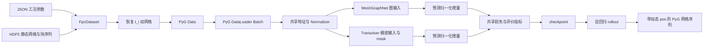

# 黏滞阻尼器 Transolver 技术文档

## 1. 文档目标

本文说明 `transolver_self` 的完整技术实现，包括：

1. COMSOL HDF5 与 JSON 参数如何组成训练样本；
2. 静态参考网格如何恢复为任意时刻的动网格；
3. MeshGraphNet 与 Transolver 如何共享特征、归一化、目标和指标；
4. PyG 图 batch 如何转换为 Transolver 的稠密输入；
5. Physics-Attention、训练、checkpoint 和时间序列 rollout 的实现；
6. 如何保证两个模型的比较公平。

本文对应 THUML Transolver 官方仓库版本：

```text
repository: https://github.com/thuml/Transolver
revision:   75e0f67643806a81cd1d3f6adc88dd8c02416fe7
license:    MIT
```

官方仓库的本地 checkout 位于 `transolver_self/official_source/Transolver`。实际运行代码位于 `transolver_self/model`，移除了官方实现对 `timm` 和 `einops` 的非必要依赖，并增加了变节点数 batch mask；Physics-Attention 的核心计算保持一致。

## 2. 系统数据流



两个模型的差异被限制在模型主干：MeshGraphNet 使用网格边做消息传递，Transolver 使用节点到 physics slice 的注意力。数据、时间步、节点物理特征、输出目标和评价函数保持相同。

## 3. 数据存储契约

### 3.1 HDF5

每个 `Case_XXXX.h5` 表示一个工况。当前读取器使用以下数据：

```text
/mesh/coordinates       静态参考节点坐标，至少 [N,2]
/mesh/connectivity      VTK flattened connectivity
/time_steps             物理时间数组 [S]
/fields/p               压力序列 [S,N]
/fields/T               温度序列 [S,N]
```

`mesh/connectivity` 中每个单元以 `节点数, 节点编号...` 存储。`vtk_cells_to_tri_faces()` 将三角形直接保留，将大于三边的多边形扇形三角化，最终生成 PyG `face=[3,F]`。

HDF5 只保存静态参考坐标和静态拓扑。训练时不会从 HDF5 读取每个时刻的节点位置，而是根据 JSON 参数和时间实时计算。

### 3.2 JSON 工况参数

默认参数文件为：

```text
计算有限元数据/4_Combined_Master_Dataset.json
```

读取器按 `case_id` 将 HDF5 与 JSON 项对应。10 个工况特征依次为：

```text
c, sx, sy, r1, a2, b1, b2, A, Ts, mu
```

几何长度和位移幅值默认从 mm 乘 `1e-3` 转换为 m；`Ts` 保持秒；`mu` 保持 JSON 中的物理单位。模型中的坐标、位移和网格速度均按 SI 长度单位处理。

### 3.3 数据划分

`FpcDataset` 对当前目录中的 HDF5 文件按文件名排序，然后按工况划分：

```text
train: 前 80%
valid: 接下来 10%
test:  最后 10%
```

划分单位是工况，不是时间帧，因此同一工况的相邻帧不会同时进入不同集合。

重要限制：COMSOL 尚未算完时，HDF5 文件数仍在变化，划分边界也会变化。正式比较必须等待数据完成，或者冻结明确的工况文件清单。

## 4. 动网格实时恢复

### 4.1 参考液体域

设参考节点坐标为 `(R_i, Z_i)`。代码根据 JSON 几何参数计算：

```text
r2    = r1 + sx
h_all = 2*b1 + 2*sy + b2
```

实现验证液体参考域边界为：

```text
R ∈ [r1, r2]
Z ∈ [b1, h_all-b1]
```

验证只作用于静态参考网格，避免把已经移动过的坐标再次当作参考坐标。

### 4.2 活塞位移和速度

活塞位移严格使用：

```text
m(t) = A * (1 - cos(2*pi*t/Ts))
```

其解析速度为：

```text
v(t) = A * (2*pi/Ts) * sin(2*pi*t/Ts)
```

代码直接计算解析导数，没有使用有限差分，因此节点速度不受时间采样间隔误差影响。

### 4.3 三段网格区域

节点只按静态参考高度 `Z_i` 分类一次：

```text
LOWER  = 0: Z_i < b1 + sy
MIDDLE = 1: b1 + sy <= Z_i <= b1 + sy + b2
UPPER  = 2: Z_i > b1 + sy + b2
```

每个节点相对活塞位移的运动权重为：

```text
LOWER:  w_i = (Z_i-b1)/sy
MIDDLE: w_i = 1
UPPER:  w_i = (h_all-b1-Z_i)/sy
```

权重最终裁剪到 `[0,1]`。当前节点状态为：

```text
node_displacement_i = w_i * m(t)
pos_i(t)             = [R_i, Z_i + node_displacement_i]
mesh_velocity_i(t)   = [0, w_i * v(t)]
```

因此拓扑 `face` 不变，只有 `pos[:,1]` 随时间变化。径向坐标不移动。

## 5. 一步训练样本

对一个有 `S` 个存储时刻的工况，数据集生成 `S-1` 个样本：

```text
sample 0: t_0 -> t_1
sample 1: t_1 -> t_2
...
sample S-2: t_(S-2) -> t_(S-1)
```

这里的“步进为 1”是时间数组索引增加 1，不是物理时间增加 1 秒：

```text
index step = 1
physical dt_i = time_steps[i+1] - time_steps[i]
```

读取器直接使用 HDF5 中的实际时间值，不假设 `dt` 恒定。当前检查到 `Case_0001` 有 151 帧，时间从 `0` 到 `0.861 s`，相邻帧 `dt=0.00574 s`。

每个样本的当前场和标签为：

```text
current_fields = [p_i, T_i]
next_fields    = [p_(i+1), T_(i+1)]
target_delta   = next_fields - current_fields
```

两个模型都预测同一个一步增量 `target_delta`。

## 6. PyG Data 对象

单个样本返回的 `torch_geometric.data.Data` 包含：

| 属性 | 形状 | 说明 |
|---|---:|---|
| `x` | `[N,3]` | node type、当前压力、当前温度 |
| `y` | `[N,2]` | 下一时刻压力和温度 |
| `pos` | `[N,2]` | 当前时刻实时恢复的节点坐标 |
| `face` | `[3,F]` | 静态三角形拓扑 |
| `mesh_region` | `[N]` | 三段区域编号 |
| `mesh_motion_weight` | `[N]` | 节点运动权重 `w_i` |
| `node_displacement` | `[N,1]` | 当前节点 Z 位移 |
| `mesh_velocity` | `[N,2]` | 当前节点网格速度 |
| `piston_displacement` | `[1]` | 当前活塞位移 |
| `piston_velocity` | `[1]` | 当前活塞速度 |
| `case_features` | `[1,10]` | 工况特征 |
| `time` | `[1]` | 当前物理时间 |
| `case_id` | string | 工况编号 |

PyG `DataLoader` 将多个图拼成一个不连通大图，同时产生：

```text
batch: 每个节点所属图编号 [sum(N_b)]
ptr:   每张图节点区间 [B+1]
```

## 7. 两模型共享的特征契约

共享代码位于 `meshGraphNet_self/features.py`。它同时被 MeshGraphNet 和 Transolver 调用，避免两套特征逻辑逐渐偏离。

### 7.1 节点特征

完整有效节点特征共 22 维：

| 组成 | 维数 | 是否归一化 |
|---|---:|---|
| 当前 `p,T` | 2 | 是 |
| 当前 `R,Z` | 2 | 是 |
| 网格速度 `v_R,v_Z` | 2 | 是 |
| 三段区域 one-hot | 3 | 否 |
| 工况和时间 context | 13 | 是 |

13 维 context 为：

```text
c, sx, sy, r1, a2, b1, b2, A, Ts, mu,
time, piston_displacement, piston_velocity
```

MeshGraphNet 将 22 维拼成一个扁平节点特征。Transolver 按官方接口拆为：

```text
position = normalized(R,Z)                         [B,N,2]
function = normalized(p,T)
         + normalized(mesh_velocity)
         + region_one_hot
         + normalized(context)                    [B,N,20]
```

拆分方式不同，但物理信息和归一化值相同。

### 7.2 Normalizer

两个模型直接使用同一个 `meshGraphNet_self.utils.normalization.Normalizer` 类。对数据 `x`：

```text
训练集流式 Welford -> count, mean, M2
var   = M2/count
std   = sqrt(var)
x_hat = (x-mean)/std
x     = x_hat*std + mean
```

所有累计量使用 `float64`。统计只在网络优化前完整扫描一次训练集，随后永久冻结；
训练、验证、测试和 rollout 都不再修改统计量。统计量以 PyTorch buffer 保存：

```text
acc_count
num_accumulations
acc_sum             # 版本2中保存 running mean，名称为旧 checkpoint 兼容而保留
acc_sum_squared     # 版本2中保存 Welford M2
statistics_version
```

`n=100` 时，节点统计范围是 `100 个工况×150 个输入时间步×725 个节点`，即
10,875,000 个节点-时间样本。程序按 batch 流式合并，不会一次性占用对应内存。
验证集和测试集完全不参与统计，避免数据泄漏。统计同时写入
`checkpoints/normalization_stats.pt` 和模型 checkpoint。

共同的归一化器为：

| 名称 | 维数 | 统计粒度 |
|---|---:|---|
| `field_normalizer` | 2 | 所有有效节点 |
| `position_normalizer` | 2 | 所有有效节点 |
| `mesh_velocity_normalizer` | 2 | 所有有效节点 |
| `context_normalizer` | 13 | 每张图一次，再广播到节点 |
| `output_normalizer` | 2 | 所有有效节点增量 |

MeshGraphNet 额外拥有 `edge_normalizer=[delta_R, delta_Z, distance]`，因为它使用图边；Transolver 不消费边特征，因此没有这一项。这个差异不改变节点输入和输出目标。

### 7.3 严格相同统计量的条件

两个模型的 Normalizer 定义相同。节点和目标统计量严格一致要求：

1. 使用同一份冻结的数据文件；
2. 使用相同 train 划分；
3. 使用相同的物理字段和特征定义。

Welford 合并仅有浮点舍入级的顺序差异，不再随 epoch 改变。MeshGraphNet 还会单独统计边特征，Transolver 不使用图边，因此没有这项统计。

## 8. MeshGraphNet batch 与 Transolver batch

### 8.1 MeshGraphNet

MeshGraphNet 对动态 `pos` 执行：

```text
FaceToEdge
Cartesian -> [delta_R, delta_Z]
Distance  -> distance
```

得到 `edge_attr=[delta_R,delta_Z,distance]`。多个图在 PyG 中保持为不连通大图，消息只沿各自工况的边传播。

### 8.2 Transolver

Transolver 需要 `[B,N,C]`。`pack_pyg_nodes()` 根据 `ptr` 将扁平节点打包：

```text
flat values [sum(N_b),C]
    -> dense values [B,max(N_b),C]
    -> node_mask    [B,max(N_b)]
```

当前工况通常具有相同节点数，但实现支持不同节点数。padding 节点会在 slice 聚合和最终输出中乘 mask，不参与 Physics-Attention，也不会进入损失和指标。

## 9. Transolver 模型结构

默认模型配置：

| 参数 | 默认值 |
|---|---:|
| `space_dim` | 2 |
| `function_dim` | 20 |
| `output_size` | 2 |
| `hidden_size` | 256 |
| `layers` | 8 |
| `heads` | 8 |
| `slice_num` | 32 |
| `mlp_ratio` | 1 |
| `dropout` | 0 |

`hidden_size` 必须能够被 `heads` 整除。默认 Transolver 约有 2,817,346 个参数；默认 MeshGraphNet 约有 2,879,234 个参数，参数规模接近。

### 9.1 输入映射

`position` 和 `function` 拼成 22 维后，经 MLP 映射到隐藏维，并加入可学习 placeholder：

```text
h_0 = preprocess(concat(position,function)) + placeholder
```

### 9.2 Physics-Attention

设隐藏状态为 `X=[B,N,C]`，head 数为 `H`，每个 head 维度为 `D=C/H`，slice 数为 `G`。

首先产生用于切片的表示和物理值：

```text
X_mid  = W_x(X)  -> [B,H,N,D]
FX_mid = W_fx(X) -> [B,H,N,D]
```

每个节点到 physics slice 的权重为：

```text
S = softmax(W_slice(X_mid)/temperature) -> [B,H,N,G]
```

节点聚合为 slice token：

```text
token[h,g] = sum_n(FX_mid[h,n] * S[h,n,g])
             / (sum_n(S[h,n,g]) + 1e-5)
```

然后只在 `G` 个 slice token 间执行缩放点积注意力：

```text
Q = W_q(token)
K = W_k(token)
V = W_v(token)
A = softmax(Q*K^T/sqrt(D))
token_out = A*V
```

最后使用同一个切片权重投影回节点：

```text
node_out[h,n] = sum_g(token_out[h,g] * S[h,n,g])
```

与直接对 `N` 个节点做全注意力相比，主要注意力矩阵从 `N*N` 变为 `G*G`。当 `G << N` 时可以显著降低注意力部分开销。

### 9.3 Transolver block

每层执行：

```text
X <- X + PhysicsAttention(LayerNorm(X))
X <- X + MLP(LayerNorm(X))
```

前 7 层输出隐藏状态。第 8 层额外执行 LayerNorm 和线性投影，输出每个有效节点的两个归一化增量。

## 10. 目标、损失与评价指标

两个模型共享训练目标：

```text
delta_true = [p_(i+1)-p_i, T_(i+1)-T_i]
delta_hat_true = output_normalizer(delta_true)
```

模型输出 `delta_hat_pred`，训练损失为所有节点和两个物理量上的均方误差：

```text
normalized_mse = mean((delta_hat_pred-delta_hat_true)^2)
```

物理量预测为：

```text
next_pred = current_fields + output_normalizer.inverse(delta_hat_pred)
```

验证指标直接复用 `meshGraphNet_self.training.evaluate()`：

```text
rmse_p = sqrt(sum((p_pred-p_true)^2)/node_count)
rmse_T = sqrt(sum((T_pred-T_true)^2)/node_count)
```

`p` 和 `T` 的单位不同，因此不将两个物理 RMSE 直接平均。checkpoint 的最佳模型按无量纲 `normalized_mse` 选择。

## 11. 训练流程

`transolver_self/train_worker.py` 复用 MeshGraphNet 的：

```text
FIELD_NAMES
seed_everything
create_dataloader
train_one_epoch
evaluate
checkpoint_state
save_checkpoint
restore_checkpoint
```

默认优化配置：

| 项目 | 默认值 |
|---|---:|
| epoch | 100 |
| batch size | 4 |
| optimizer | Adam |
| learning rate | `1e-4` |
| weight decay | 0 |
| gradient clip | 1.0 |
| scheduler | ReduceLROnPlateau |
| scheduler factor | 0.5 |
| scheduler patience | 5 |
| seed | 42 |

训练过程中，每个 epoch 保存 `last.pt`；验证更优时保存 `best.pt`；达到 `save_every` 时保存周期 checkpoint。保存采用临时文件后替换，避免中断留下半写入文件。

checkpoint 内容包括：

```text
epoch
global_step
model_state_dict
optimizer_state_dict
scheduler_state_dict
best_valid_loss
model_config
field_names
case_feature_names
model_name
official_revision
```

## 12. 时间序列 rollout

rollout 从 HDF5 读取指定起点的真实 `p,T`，后续全部使用模型预测：

```text
真实初始场 x_0
  -> 预测 x_1
  -> 用预测 x_1 预测 x_2
  -> ...
```

在第 `i` 步，程序使用真实 `time_steps[i]` 重新调用 `get_mesh_at_time()`，因此每一步都会重新计算：

```text
pos
mesh_velocity
mesh_region
mesh_motion_weight
node_displacement
piston_displacement
piston_velocity
```

模型预测场是自回归的，但网格运动仍由已知解析规律和真实时间确定，不由模型预测。

输出 `.pt` 包含 PyG `Data` 列表。第 0 项是初始网格，其后每项是下一时刻的动态网格和预测场：

```text
mesh.pos
mesh.face
mesh.predicted_fields
mesh.p
mesh.T
mesh.mesh_velocity
mesh.time
mesh.case_id
```

同时计算整个 rollout 相对于 HDF5 真值的 `rollout_rmse_p` 和 `rollout_rmse_T`。

## 13. 公平对比约束

MeshGraphNet 与 Transolver 对比时应固定：

| 项目 | 要求 |
|---|---|
| HDF5 文件快照 | 完全相同 |
| JSON 参数版本 | 完全相同 |
| train/valid/test 工况 | 完全相同 |
| 时间索引步长 | 都为 1 |
| 当前场和目标场 | 完全相同 |
| 动网格位置和速度 | 完全相同 |
| 节点特征 | 完全相同 |
| 节点和输出 Normalizer | 同一实现与统计范围 |
| batch size、seed、epoch | 完全相同 |
| checkpoint 选择 | 都按 valid normalized MSE |
| 报告指标 | 单步 p/T RMSE 与 rollout p/T RMSE |

不可强行相同的模型特有部分：

```text
MeshGraphNet: edge_index、edge_attr、edge_normalizer、15 次消息传递
Transolver:   dense node batch、padding mask、8 层 Physics-Attention
```

正式实验应同时报告模型参数量、单步误差、完整 rollout 误差、训练时间和推理时间。

## 14. 当前验证状态与限制

已经验证：

1. 三段运动权重与 COMSOL 公式一致；
2. 节点速度是位移公式的解析时间导数；
3. MeshGraphNet 共享特征重构后原测试全部通过；
4. Transolver 支持不同节点数图组成 batch；
5. Transolver 前向、反向、共享训练函数和共享指标通过；
6. 真实 HDF5 两图 batch 在 GPU 上完成前向和反向；
7. `Case_0001` 真实时间轴完成两步自回归动网格 rollout。

当前限制：

1. 当前冻结数据划分包含 800 个训练工况、80 个验证工况和 81 个测试工况；
2. 尚未执行完整 100 epoch 对比实验；
3. 两个模型会在优化前从各自训练子集预计算并冻结 Normalizer；共享节点统计可进一步提取为跨模型公共文件；
4. rollout 当前将所有 PyG 网格对象存入一个 `.pt`，超长序列或更大网格会增加内存和文件体积；
5. 当前只预测 `p,T`，如果增加物理场，需要同步修改 HDF5 字段、`FIELD_NAMES`、模型输出维度和评价指标。

## 15. 代码索引

| 文件 | 责任 |
|---|---|
| `meshGraphNet_self/dataset.py` | HDF5/JSON 读取和样本索引 |
| `meshGraphNet_self/mesh_motion.py` | 三段动网格解析恢复 |
| `meshGraphNet_self/features.py` | 两模型共享节点特征 |
| `meshGraphNet_self/utils/normalization.py` | float64 Welford 预统计和冻结 Normalizer |
| `training_workspace/train.py` | 唯一人工训练入口；在文件末尾定义实验变量 |
| `meshGraphNet_self/train_worker.py` | MeshGraphNet 内部训练进程 |
| `transolver_self/model/physics_attention.py` | Physics-Attention |
| `transolver_self/model/transolver.py` | Transolver 主干 |
| `transolver_self/model/simulator.py` | PyG 与 Transolver 适配 |
| `transolver_self/train_worker.py` | Transolver 内部训练进程 |
| `transolver_self/rollout.py` | 自回归序列推理 |
| `meshGraphNet_self/training.py` | 两模型共享的可恢复训练层 |
| `meshGraphNet_self/experiment_utils.py` | manifest、RNG、CSV 原子写入工具 |
| `training_workspace/create_split_manifest.py` | 冻结数据快照与固定划分 |
| `training_workspace/run_scale_study.py` | 训练入口调用的多模型、多规模、多种子调度库 |
| `training_workspace/evaluate_experiment.py` | 单任务可恢复 rollout 评价 |
| `training_workspace/plot_scale_study.py` | 汇总均值、标准差与曲线 |
