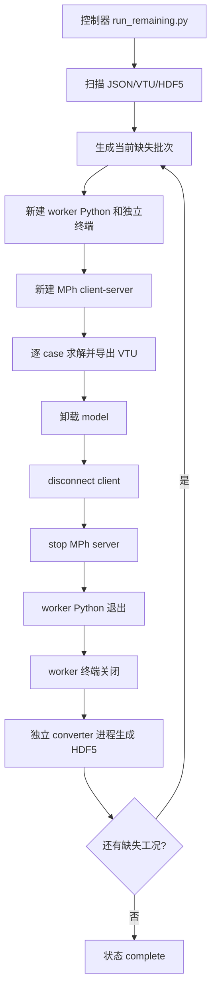

# COMSOL 自动续算技术说明

## 1. 设计目标

自动续算系统解决四个问题：

1. 只计算参数 JSON 中尚未完成的工况。
2. 使用操作系统进程作为 COMSOL 内存释放边界。
3. 中断、崩溃或转换失败后可以幂等恢复。
4. 不让半写入的 VTU/HDF5 被误判为有效训练数据。

系统选择串行批次，而不是并行 COMSOL 会话。主要原因是单个模型已经使用多核，多个并行会话会竞争内存、CPU 和 license，并削弱“每批彻底释放内存”的可控性。

## 2. 模块职责

| 文件 | 职责 |
|---|---|
| `run_remaining.py` | controller；扫描状态、分批、启动 worker、等待退出、转换、重试和写状态 |
| `main.py` | worker；只处理一个批次，管理本批 COMSOL 会话 |
| `transfer2hdf5.py` | converter；增量、原子地把指定 VTU 转为 HDF5 |
| `运行剩余工况.bat` | 固定选择 conda `pinn` Python 的 Windows 入口 |
| `test_batch_automation.py` | 不启动 COMSOL 的调度与数据完整性测试 |

controller 不导入或持有 COMSOL client。只有 worker 进程调用 `mph.start()`，这是保证 COMSOL/JVM 生命周期不泄漏到下一批的关键边界。

## 3. 进程结构



控制器必须持续存在，否则没有进程可以在 worker 终端关闭后启动下一批。内存隔离要求退出的是 worker、MPh client、COMSOL server 和 JVM，而不是 controller。

## 4. 工况来源与顺序

`load_case_ids()` 从以下结构读取工况：

```json
{
  "parameters_list": [
    {"case_id": "Case_0001"},
    {"case_id": "Case_0002"}
  ]
}
```

调度顺序严格沿用 `parameters_list` 的顺序，并拒绝重复 `case_id`。`--first-case/--last-case` 对这个列表做 1-based、两端包含的切片。

没有随机打乱的原因是：

- 日志和缺失区间更容易阅读。
- 中断恢复顺序稳定。
- 可以按序号明确划分人工检查区间。

## 5. 完成状态判定

### 5.1 HDF5 有效条件

HDF5 必须同时满足：

1. 文件存在且大于 1024 字节。
2. 存在 `mesh/coordinates`。
3. 存在非空 `mesh/connectivity`。
4. 存在一维、非空 `time_steps`。
5. `fields` 至少包含一个物理场。
6. 每个场的形状都严格等于 `[时间步数, 节点数]`。

有效 HDF5 是最高优先级完成标记，即使原始 VTU 已被移动，也不会重新计算。

### 5.2 VTU 有效条件

VTU 必须：

1. 文件存在且大于 1024 字节。
2. 文件尾部包含 XML 结束标签 `</VTKFile>`。

如果 VTU 有效但 HDF5 无效或不存在，controller 只调度 converter，不重新运行 COMSOL。

### 5.3 未完成条件

HDF5 和 VTU 均未通过校验时，case 才会进入 COMSOL worker。

状态优先级：

```text
有效 HDF5 > 有效 VTU > 未完成
```

## 6. 分批算法

核心逻辑可概括为：

```text
读取有序 case_id
转换已有 VTU-only case
for 尝试次数 in 1..max_retries+1:
    扫描 HDF5 和 VTU
    missing = 同时缺少有效 HDF5/VTU 的 case
    if missing 为空:
        结束
    for batch in chunk(missing, batch_size):
        写状态 running
        启动全新 worker 进程
        等待 worker 完全退出
        转换本批有效 VTU
        写状态 between_batches
        等待 pause_seconds
最终重新扫描并写 complete 或 incomplete
```

每一轮都会重新读取文件系统，不依赖内存中的“成功列表”。因此即使 controller 中断，下一次运行仍能从磁盘事实恢复。

## 7. worker 生命周期

### 7.1 启动

worker 显式设置：

```python
mph.option("session", "client-server")
client = mph.start(cores=cores)
```

client-server 模式让 MPh 持有明确的 server 进程对象，批次末尾可以显式停止。

### 7.2 单个 case

每个 case 的步骤为：

1. 从母版重新加载 model。
2. 注入几何、载荷和材料参数及单位。
3. 调用 `model.mesh()`。
4. 调用 `model.solve()`。
5. 导出临时 VTU。
6. 校验临时文件体积。
7. 原子替换正式 VTU。
8. 使用 `client.remove(model)` 卸载当前 model。
9. 调用 Python GC，减少同一小批内部的暂存对象。

一个 case 失败不会阻止同批其他 case；worker 最后返回失败 case 的总体退出状态。

### 7.3 批次关闭

关闭顺序：

```text
卸载最后一个 model
client.disconnect()
mph_session.server.stop(timeout=30)
gc.collect()
worker 返回退出码
Python 进程结束
独立 Windows 终端关闭
```

即使 Python 层的 disconnect 或 stop 报错，worker 进程退出仍是最终释放 JVM 和进程内资源的兜底边界。

## 8. Windows 子进程隔离

controller 使用 `subprocess.Popen` 直接启动当前 `sys.executable`，因此 controller 在 `pinn` 环境运行时，所有 worker 也必然使用同一个 `pinn` Python。

默认 creation flag：

```python
subprocess.CREATE_NEW_CONSOLE
```

这会为每批创建独立终端。使用 `--no-worker-window` 时改为：

```python
subprocess.CREATE_NO_WINDOW
```

两种模式的进程隔离相同，区别只是是否显示窗口。

超时时，controller 执行：

```text
taskkill /PID <worker_pid> /T /F
```

`/T` 会终止 worker 及其子进程树，避免只杀 Python 而留下 COMSOL server。

## 9. 原子文件发布

### 9.1 VTU

正式目标：

```text
comsol_output/Case_XXXX.vtu
```

临时目标：

```text
comsol_output/.Case_XXXX.<PID>.partial.vtu
```

COMSOL 导出成功并通过最小校验后，使用 `os.replace()` 原子替换正式文件。

### 9.2 HDF5

临时目标：

```text
comsol_hdf5/.Case_XXXX.<PID>.partial.h5
```

converter 完成写入、flush 并重新打开验证结构后，才使用 `os.replace()` 发布正式 HDF5。

原子替换保证 controller 不会在另一个进程仍在写文件时看到半成品正式文件。

## 10. VTU 到 HDF5

converter 从 VTU point data 中匹配：

```text
<field_name>_@_t=<time_value>
```

所有场必须是长度为节点数的节点标量场。同一物理场必须覆盖完整时间轴；任何时间步缺失都会报错，不再用零值静默填充。

生成结构：

```text
Case_XXXX.h5
├── mesh
│   ├── coordinates
│   └── connectivity
├── time_steps
└── fields
    ├── p
    └── T
```

转换在独立 Python 子进程中运行。它发生在 COMSOL worker 已退出之后，因此 PyVista/HDF5 处理不会延长 COMSOL 会话生命周期。

## 11. 重试语义

`--max-retries 2` 表示：

```text
首次尝试 1 次 + 额外重试 2 次 = 最多 3 次
```

重试单位不是固定的原始 batch，而是重新扫描后仍未完成的 case。这样能够自动缩小重试集合：

- 同批成功项不会重算。
- 求解失败项重新进入 COMSOL。
- VTU 成功但转换失败项只重试转换。
- 损坏正式文件会被重新识别。

达到上限后，controller 写入 `incomplete` 状态并返回退出码 1，不会假装全部完成。

## 12. 状态文件一致性

`batch_state.json` 自身也采用临时文件加 `os.replace()` 更新。它是人和外部监控程序的进度接口，但不是断点续算的唯一依据。

真正的恢复依据始终是经过结构校验的 VTU/HDF5。即使状态文件丢失，重新运行 controller 仍能恢复。

## 13. 异常边界

| 异常位置 | 处理方式 |
|---|---|
| 单个 case 求解失败 | 记录完整堆栈，继续同批其他 case，后续重试 |
| worker 启动失败 | 返回非零，controller 保留未完成项 |
| worker 超时 | 杀掉整个进程树，后续重试 |
| 用户在 controller 按 Ctrl+C | 杀掉当前 worker 树，写 `interrupted` |
| VTU 转换失败 | 保留原 VTU，只重试转换 |
| HDF5 校验失败 | 不发布临时文件，不覆盖旧的有效文件 |
| controller 自身异常 | 写 `controller_error`，已有原子输出可继续使用 |

## 14. 幂等性

同一条完整运行命令可以反复执行：

- 已完成 case 被跳过。
- 中断产生的 `.partial` 文件不参与完成判定。
- 有 VTU 无 HDF5 时只补转换。
- 失败 case 会再次尝试。

因此不需要人工维护“上次算到第几个”的计数文件，也不应通过手工修改起始编号来恢复全部流程。

## 15. 当前限制

1. 仅支持本机 Windows 调度和 `taskkill` 进程树清理。
2. 每次只运行一个 COMSOL worker，不支持并行 license 调度。
3. VTU 完整性采用体积和 XML 结束标签快速判断；深层数据结构在 HDF5 转换时由 PyVista 验证。
4. 自动流程保留 VTU，不负责磁盘归档或删除。
5. 母版中的导出节点名称固定为 `data1`；若 MPH 模型修改导出节点，需要同步修改 `main.py`。
6. 当前注入参数固定为 `c/sx/sy/r1/a2/b1/b2/A/Ts/mu_0`。

## 16. 验证

语法检查：

```powershell
conda activate pinn
python -m py_compile .\计算有限元数据\main.py .\计算有限元数据\run_remaining.py .\计算有限元数据\transfer2hdf5.py
```

自动化测试：

```powershell
python -m unittest discover -s .\计算有限元数据 -p "test_*.py" -v
```

只读真实数据计划：

```powershell
python .\计算有限元数据\run_remaining.py --dry-run
```

提交前验证结果为自动化测试 7 项通过，真实计划扫描识别 1000 个总工况、246 个有效 HDF5 和 754 个待计算工况。
